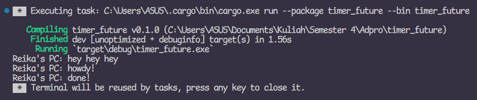
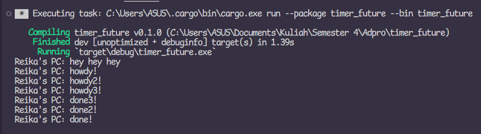
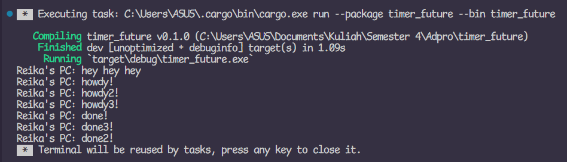
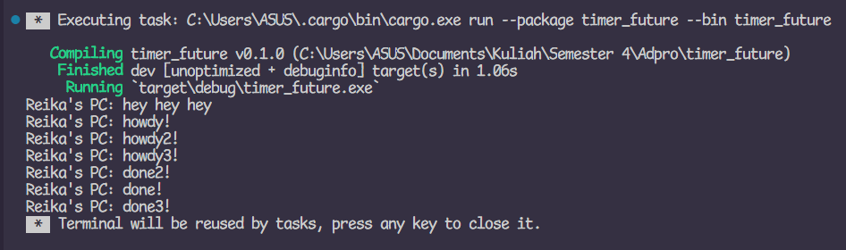

#### Nama: Athira Reika
#### NPM: 2206031422
#### Kelas: Adpro B
---
### Refleksi

#### 1.2 Understanding how it works

The println outside of the spawner.spawn() is executed before the println inside. As an async function, it runs separately as it waits for the result of a future, while the println outside of it can be executed first as main proceeds to run.

#### 1.3: Multiple Spawn and removing drop
When I removed the drop(spawner):

When I put it back (run twice):

When I removed the drop(spawner), the program wouldn't end unless I forced it to. This is because without the drop(spawner), the program is still waiting for a task to spawn, which is why the program successfully ends after I put the drop(spawner) back in. The order that the println statements are executed isn't the same in every execution. Each time a spawner calls spawn, it spawns a task and puts it in the task sender, where the executor will take a task and execute it. The order varies because of the concurrency of asynchronous programming.